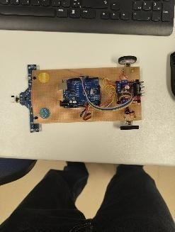
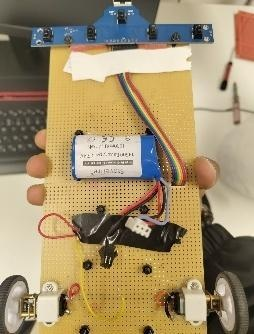
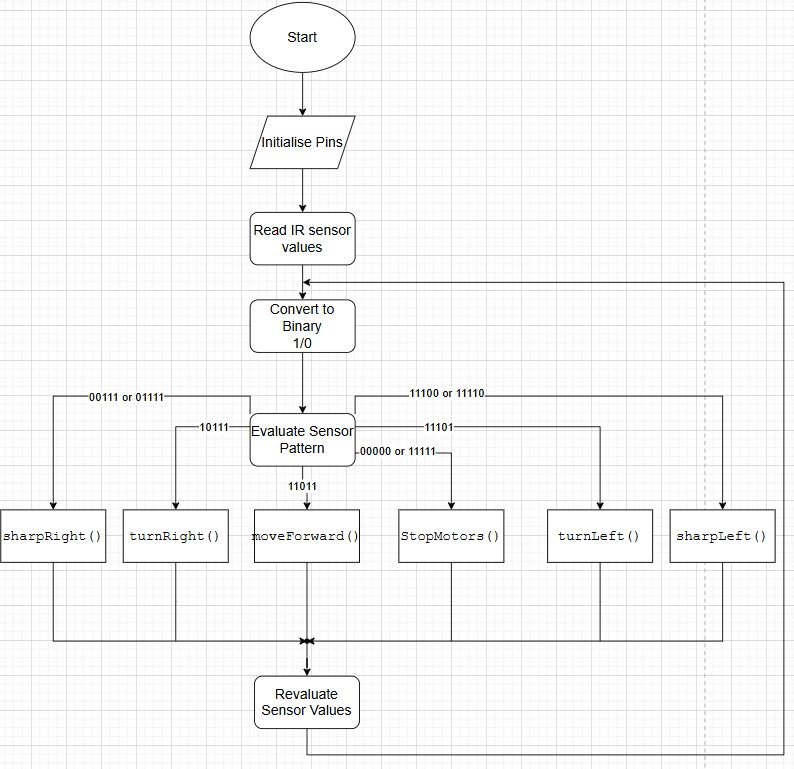
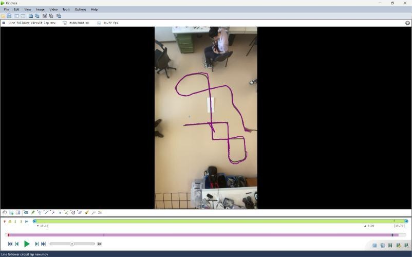
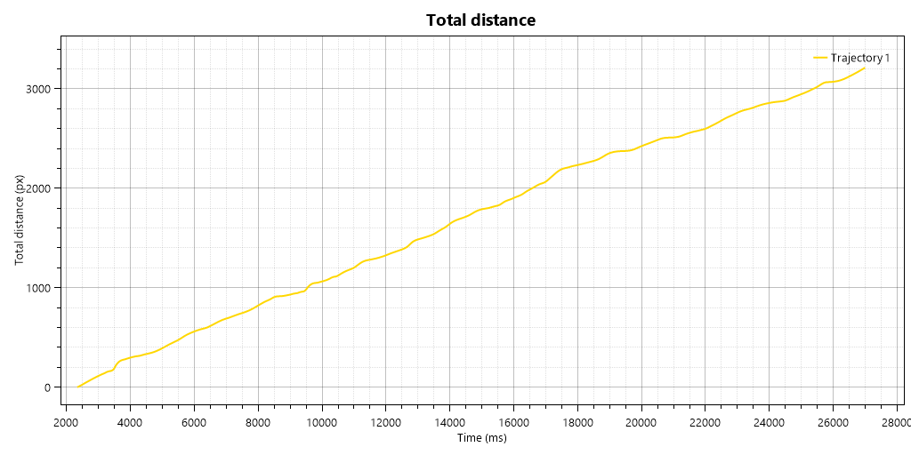
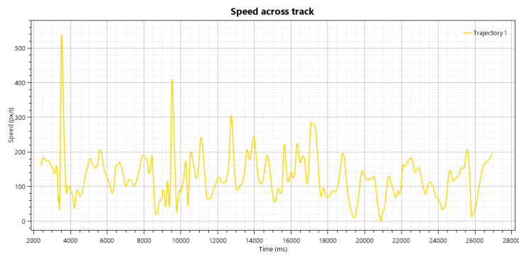
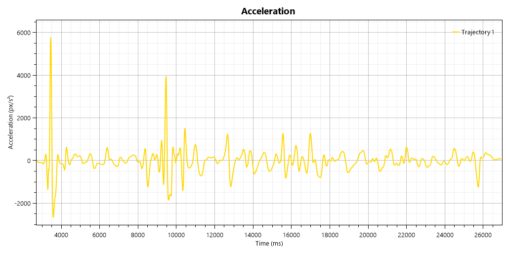

# 🤖 Autonomous Rule-Based Line Follower Mobile Robot: Design, Circuitry & Kinematic Analysis

[-blue.svg?style=flat-square&logo=arduino)](https://www.arduino.cc/)
[_Finite_State_Machine-brightgreen.svg?style=flat-square)](#3-mathematical--algorithmic-formulation)
[](https://www.kinovea.org/)
[](#team--project-context)
[](LICENSE)
[](https://github.com/sbbxiii)

---

## 1. Executive Summary

This repository contains the complete embedded firmware, electronic schematics, mechanical architecture, and video-based kinematic data analysis for an **autonomous differential-drive mobile robot** developed for an internal university robotics competition at the **University of Debrecen**.

The system utilizes an **Arduino Uno (ATmega328P)**, a **5-channel infrared (IR) reflectance sensor array**, and an **L298N dual H-bridge motor driver** to navigate complex track geometries—including continuous curves, 90° sharp corners, multi-way intersections, and physical obstacles. 

Rather than relying on continuous proportional-integral-derivative (PID) control, which requires fine encoder feedback and optical isolation, the robot employs a deterministic **$O(1)$ Finite State Machine (FSM)**. The state machine operates on binary-thresholded optical patterns with temporal memory, mapped to discrete differential-drive maneuvers. The system's kinematic performance was verified through non-invasive **2D video motion tracking via Kinovea**, quantifying velocity distributions ($100\text{--}200\text{ px/s}$) and transient acceleration spikes across the track.

> [!NOTE]
> **Academic Context**: This repository packages the engineering artifacts from an **unpublished university academic project report** co-authored by students at the Department of Mechatronics, University of Debrecen. The full engineering report is available in [`paper/Building_a_Rule_Based_Line_Follower_Robot.pdf`](paper/Building_a_Rule_Based_Line_Follower_Robot.pdf).

---

## 2. Hardware Architecture & Physical Implementation

### Physical Prototype

| Top View (Component Arrangement) | Underview (Sensor & Drive Layout) |
|:---:|:---:|
|  |  |
| *Figure 1a: Top layout showing Arduino Uno, L298N driver, and central 7.4V battery pack.* | *Figure 1b: Underview showing 5-channel IR array with foam damping and rear drive wheels.* |

### Electronic Circuit Schematic
The electrical interconnects and power distribution network were designed in EasyEDA:


*Figure 2: EasyEDA circuit schematic mapping Arduino Uno GPIO/ADC pins to the L298N driver and 5-channel IR sensor array.*

### Pin Connection Matrix

| Arduino Pin | Hardware Interface | Module Terminal | Description |
|:---:|:---:|:---:|:---|
| **A0** | Analog In | Sensor `S0` | Far-Left IR Sensor ($s_1$) |
| **A1** | Analog In | Sensor `S1` | Mid-Left IR Sensor ($s_2$) |
| **A2** | Analog In | Sensor `S2` | Center Alignment Sensor ($s_3$) |
| **A3** | Analog In | Sensor `S3` | Mid-Right IR Sensor ($s_4$) |
| **A4** | Analog In | Sensor `S4` | Far-Right IR Sensor ($s_5$) |
| **D2** | PWM Out | L298N `ENA` | Left Motor Speed Enable |
| **D3** | Digital Out | L298N `IN1` | Left Motor Direction 1 |
| **D4** | Digital Out | L298N `IN2` | Left Motor Direction 2 |
| **D5** | Digital Out | L298N `IN3` | Right Motor Direction 1 |
| **D6** | Digital Out | L298N `IN4` | Right Motor Direction 2 |
| **D7** | PWM Out | L298N `ENB` | Right Motor Speed Enable |

---

## 3. Mathematical & Algorithmic Formulation

```
                     +-----------------------+
                     |  Sample Analog IR     |
                     |  Sensors (A0 - A4)    |
                     +-----------+-----------+
                                 |
                                 v
                     +-----------------------+
                     |  Binary Thresholding  |
                     |  s_i = (val < th) ? 0:1
                     +-----------+-----------+
                                 |
                                 v
                     +-----------------------+
                     | State Index Word:     |
                     | S in {0,1}^5 (32 states)
                     +-----------+-----------+
                                 |
                                 v
                     +-----------------------+
                     |  O(1) FSM Lookup      |
                     |  f: S -> Action A     |
                     +-----------+-----------+
                                 |
               +-----------------+-----------------+
               |                                   |
         Valid State                          Ambiguous State
               |                             (All-0 or All-1)
               v                                   |
        Commanded Action                           v
        a in {F, L, R, SL, SR}            Invoke Temporal Memory
               |                          Gamma(S_t) = Gamma(S_t-1)
               +-----------------+-----------------+
                                 |
                                 v
                     +-----------------------+
                     |  Actuate Motors       |
                     |  g: A -> Z^4 (PWM/Dir)|
                     +-----------------------+
```

### 1. State Space Representation
The optical feedback from the 5-channel sensor array is formalized as a binary state vector:

$$S = [s_1, s_2, s_3, s_4, s_5] \in \{0, 1\}^5$$

where:
- $s_i = 0$ indicates **black line detected** (low surface reflectivity),
- $s_i = 1$ indicates **white background detected** (high surface reflectivity).

The total theoretical state space contains $2^5 = 32$ possible states.

### 2. State-to-Action Mapping $f: S \to A$
The discrete action space is defined as:

$$A = \{F, L, R, SL, SR, H\}$$

- $F$: Move Forward (both motors driven equally)
- $L$: Slight Left Turn (differential speed reduction on left wheel)
- $R$: Slight Right Turn (differential speed reduction on right wheel)
- $SL$: Sharp Left Turn (contra-rotation: left reverse, right forward)
- $SR$: Sharp Right Turn (contra-rotation: left forward, right reverse)
- $H$: Halt / Directional Memory Hold

The mapping adheres to bilateral symmetry:

$$f([s_1, s_2, s_3, s_4, s_5]) = \varphi\Big(f([s_5, s_4, s_3, s_2, s_1])\Big)$$

| State Vector $S$ | Binary Pattern | Action $f(S)$ | Physical Track Meaning |
|:---:|:---:|:---:|:---|
| $[1, 1, 0, 1, 1]$ | `0b11011` (27) | **$F$ (Forward)** | Line is perfectly centered under sensor 3 |
| $[1, 1, 0, 0, 1]$ or $[1, 1, 1, 0, 1]$ | `0b11001` / `0b11101` | **$L$ (Slight Left)** | Line deviating left; gentle steering correction |
| $[1, 0, 0, 1, 1]$ or $[1, 0, 1, 1, 1]$ | `0b10011` / `0b10111` | **$R$ (Slight Right)** | Line deviating right; gentle steering correction |
| $[1, 1, 1, 0, 0]$ or $[1, 1, 1, 1, 0]$ | `0b11100` / `0b11110` | **$SL$ (Sharp Left)** | 90° left corner / branch detected; contra-rotation pivot |
| $[0, 0, 1, 1, 1]$ or $[0, 1, 1, 1, 1]$ | `0b00111` / `0b01111` | **$SR$ (Sharp Right)** | 90° right corner / branch detected; contra-rotation pivot |
| $[1, 1, 1, 1, 1]$ | `0b11111` (31) | **$H$ (Memory Fallback)** | Line lost: robot executes $\Gamma(S_{t-1})$ to regain line |
| $[0, 0, 0, 0, 0]$ | `0b00000` (0) | **$H$ (Memory Fallback)** | Intersection crossroad: robot maintains trajectory momentum |

### 3. Motor Actuation Mapping $g: A \to \mathbb{Z}^4$
Each action maps to dual PWM duty cycles ($v_L, v_R$) and directional polarities ($d_L, d_R \in \{+1, -1, 0\}$):

$$g(F) = (v, v, +1, +1)$$

$$g(L) = (\alpha v, v, +1, +1)$$

$$g(R) = (v, \alpha v, +1, +1)$$

$$g(SL) = (v, v, -1, +1)$$

$$g(SR) = (v, v, +1, -1)$$

$$g(H) = (0, 0, 0, 0)$$

where $\alpha \in [0.3, 0.8]$ is the differential attenuation scalar tuned to maintain line acquisition without introducing oscillatory slip.

### 4. Decision Flowchart

*Figure 3: Deterministic finite-state control flowchart evaluated in $O(1)$ time per loop iteration.*

---

## 4. Test Course Topology & Scenarios

The robot was empirically evaluated on a dedicated multi-feature course constructed from dual $3.82\text{ cm}$ black electrical tape on a high-contrast vinyl surface:


*Figure 4: Test track topology incorporating continuous curves, 4-way intersections, T-junctions, 90° square loops, and physical obstacles.*

1. **Continuous Curved Loop**: Tests trajectory smoothness and prevents lateral hunting.
2. **Four-Way Crossroads**: Tests ambiguity resolution when all sensors read black ($S = [0, 0, 0, 0, 0]$).
3. **Obstacle Incursion**: Physical obstacle partially obstructing the path to test alignment recovery and low-end motor torque.
4. **Center T-Junction**: Tests deterministic branch selection.
5. **Square Loop (90° Corners)**: Exercises the differential contra-rotation pivot maneuvers (`sharpRight()` / `sharpLeft()`).

---

## 5. Kinematic Motion Tracking Analysis (Kinovea)

To quantify performance non-invasively, 2D video motion tracking was performed across a full test lap using **Kinovea** at ~31.8 fps:


*Figure 5: 2D kinematic trajectory tracking across the test track in Kinovea.*

### Empirical Kinematic Profiles

| Total Distance Profile | Speed Across Track |
|:---:|:---:|
|  |  |
| *Figure 6a: Cumulative distance (px) showing steady progression with brief leveling at turns.* | *Figure 6b: Velocity profile showing nominal speed between 100–200 px/s with sharp transient spikes.* |


*Figure 7: Rate of change of velocity ($\text{px/s}^2$) highlighting high-frequency corrections and major transient spikes at ~3,500 ms and ~9,500 ms.*

### Kinematic Findings:
- **Baseline Velocity**: Maintained an average forward velocity between **$100\text{--}200\text{ px/s}$** during straight tracking and gradual curvature.
- **Acceleration Transients**: Distinct acceleration spikes occur at **$t \approx 3,500\text{ ms}$** and **$t \approx 9,500\text{ ms}$** corresponding to sharp corner recoveries where the robot transitioned rapidly between pivot turns and straight line acquisition.
- **Deceleration Dips**: Brief velocity dips occur during wheel direction reversal in sharp pivot maneuvers, validating the trade-off between discrete FSM stability and mechanical smoothness.

---

## 6. Engineering Trade-offs: Rule-Based FSM vs. PID

During development, the team evaluated both discrete rule-based control and continuous proportional-integral-derivative (PID) control:

| Design Dimension | Rule-Based FSM (Implemented) | Continuous PID Control |
|:---|:---|:---|
| **Computational Overhead** | **$O(1)$ constant time** lookup table; minimal CPU cycles | Requires floating-point arithmetic and continuous error computation |
| **Rotary Encoder Dependency** | **None**; operates open-loop using optical reflectance only | Typically requires wheel speed feedback for accurate derivative tuning |
| **Mechanical Weight Tolerance** | Highly resilient to the robot's rear-heavy center of gravity | Jerky oscillation due to front sensor lift during high acceleration |
| **Analog Optical Noise** | Completely filtered by binary thresholding | Fluctuations in analog optical levels distort the differential error term |
| **Corner Recovery** | Deterministic contra-rotation maneuvers | Risk of derivative windup or loss of line on 90° right angles |

---

## 7. Repository Structure

```
rule-based-line-follower/
├── README.md                      # Primary project documentation & analysis
├── LICENSE                        # MIT Open Source License
├── .gitignore                     # Git tracking exclusions
├── firmware/
│   ├── rule_based_follower.ino    # Arduino Uno main firmware loop
│   ├── config.h                   # Pinout definitions & PWM speed constants
│   └── fsm_table.h                # O(1) 32-state FSM lookup table
├── hardware/
│   ├── circuit_schematic.png      # High-resolution EasyEDA schematic
│   ├── pinout_mapping.md          # Wiring interconnects & electrical notes
│   └── bill_of_materials.md       # Complete component BOM and ratings
├── analysis/
│   ├── kinematic_analysis.py      # Python script to analyze Kinovea telemetry
│   └── test_scenarios.md          # Detailed scenario matrix and track specifications
├── paper/
│   ├── Building_a_Rule_Based_Line_Follower_Robot.pdf  # Full university research report
│   └── README.md                  # Academic context and attribution note
└── media/                         # High-resolution schematics, photos, and plots
    ├── robot_top.jpg
    ├── robot_bottom.jpg
    ├── circuit_diagram.png
    ├── fsm_control_flowchart.png
    ├── test_track_layout.jpg
    ├── kinovea_tracking_lap.jpg
    ├── kinematic_distance_curve.png
    ├── kinematic_speed_curve.png
    └── kinematic_acceleration_curve.png
```

---

## 8. Team & Project Context

This robot was designed, built, and analyzed as part of an engineering competition project at the:  
**Department of Mechatronics, Faculty of Engineering, University of Debrecen (Debrecen, Hungary)**

**Team Members & Co-Authors:**
- **Azar Animon**
- **Malak Hiba**
- **David Pani**
- **John Stephen Barka**
- **Osakwe Nmesoma Chukwukadibia** ([@sbbxiii](https://github.com/sbbxiii))
