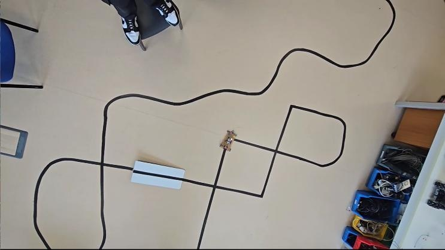

# 🏁 Track Design & Scenario Testing Matrix

This document outlines the test course layout, physical obstacle configurations, and empirical scenario evaluations conducted on the mobile robot prototype.

---

## 1. Test Course Topology

*Figure: Empirical evaluation course featuring multi-feature navigational challenges constructed with 3.82 cm dual electrical tape.*

### Track Parameters
- **Line Material**: 2x parallel strips of matte black PVC electrical tape
- **Path Width**: $3.82\text{ cm}$
- **Surface**: High-contrast, light-colored vinyl flooring
- **Course Dimensions**: Approximately $3.5\text{ m} \times 2.8\text{ m}$

---

## 2. Navigational Test Scenarios

The track incorporates six distinct topological features specifically designed to test discrete FSM decision boundaries:

### A. Continuous Curved Path (Top Section)
- **Objective**: Evaluate trajectory smoothness and sustained steering response through continuous curvature without lateral oscillation.
- **Sensor Signature**: Center sensor ($s_3 = 0$) with alternating transitions on adjacent sensors ($s_2, s_4$).
- **Observed Behavior**: Navigated successfully, though minor discrete overshoots were observed due to the lack of continuous proportional feedback.

### B. Four-Way Intersection (Crossroads - Left-Center)
- **Objective**: Verify rule priority when all sensors simultaneously detect black ($S = [0, 0, 0, 0, 0]$).
- **Rule Action**: Directional memory forward lock ($\Gamma(S_{\text{cross}}) = \Gamma(S_{t-1})$) allowing momentum to traverse the perpendicular crossing without false turns.
- **Observed Behavior**: Clean, uninterrupted traverse with zero heading divergence.

### C. Partially Obstructed Straight Segment (Bottom-Left)
- **Objective**: Assess physical disturbance recovery when one track edge is obscured by a physical obstacle/ramp.
- **Observed Behavior**: High low-end torque from the 10:1 metal gearmotors allowed the robot to mount and clear minor disturbances and instantly reacquire the line via its 5-sensor footprint.

### D. T-Junction Branching (Center)
- **Objective**: Direction selection when encountering perpendicular branching paths ($S = [0, 0, 0, 1, 1]$ or similar).
- **Observed Behavior**: Deterministic turn execution based on predefined branch priorities.

### E. Closed Square Loop (Right-Center)
- **Objective**: 90-degree corner negotiation ($S = [0, 0, 1, 1, 1]$ or $[1, 1, 1, 0, 0]$) triggering differential contra-rotation pivot maneuvers (`sharpRight()` / `sharpLeft()`).
- **Observed Behavior**: Rapid pivot execution with transient speed dips during wheel reversal.

---

## 3. Empirical Test Matrix Summary

| Test Segment | Feature Type | Primary Sensor Pattern | Triggered Action | Outcome | Stability Rating |
|:---|:---|:---:|:---:|:---|:---:|
| **Top Loop** | Gradual Curvature | `11001` / `10011` | `turnLeft()` / `turnRight()` | Smooth tracking, slight hunting | Good |
| **Center T** | Perpendicular T-Split | `00011` / `11000` | Priority Turn / `sharpRight()` | Decisive branch execution | High |
| **Crossroads** | 4-Way Perpendicular | `00000` | Directional Memory (`FORWARD`) | Preserved heading across junction | High |
| **Corner 90°** | Right-Angle Bend | `00111` / `11100` | `sharpRight()` / `sharpLeft()` | High acceleration pivot spike | Acceptable |
| **Low Battery** | Low-Voltage Drift | `11011` | `moveForward()` | Decreased forward velocity | Marginal |
