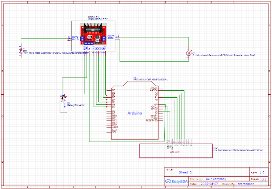

# 🔌 Hardware Pinout & Wiring Specification

This document details the complete hardware interconnection mapping for the 5-IR Rule-Based Line Follower Robot, connecting the **Arduino Uno (ATmega328P)**, **L298N Dual H-Bridge Driver**, **5-Channel IR Reflectance Array**, and DC drive motors.

---

## 1. Circuit Schematic Overview

*Figure: EasyEDA schematic mapping Arduino Uno GPIO/ADC pins to L298N motor driver and 5-channel IR reflectance sensor array.*

---

## 2. Arduino Uno to L298N Motor Driver

The L298N module controls two 6V brushed DC motors using PWM speed regulation on `ENA`/`ENB` and H-bridge direction logic on `IN1`–`IN4`.

| Arduino Uno Pin | L298N Terminal | Pin Function | Description |
|:---:|:---:|:---:|:---|
| **D2** | `ENA` | Left Motor Enable (PWM) | Controls left motor rotational velocity via PWM duty cycle |
| **D3** | `IN1` | Left Motor Direction 1 | High-side forward polarity for Left Motor |
| **D4** | `IN2` | Left Motor Direction 2 | Low-side reverse polarity for Left Motor |
| **D5** | `IN3` | Right Motor Direction 1 | High-side forward polarity for Right Motor |
| **D6** | `IN4` | Right Motor Direction 2 | Low-side reverse polarity for Right Motor |
| **D7** | `ENB` | Right Motor Enable (PWM) | Controls right motor rotational velocity via PWM duty cycle |

---

## 3. Arduino Uno to 5-Channel IR Reflectance Sensor Array

The 5 analog sensors are spaced at approximately 15 mm intervals across the front bumper. Each sensor outputs a voltage proportional to surface reflectance.

| Arduino Uno Pin | Sensor Pin | Array Position | Role in Navigation Logic |
|:---:|:---:|:---:|:---|
| **A0** | `S0` / `OUT1` | Far Left (`s1`) | Detects sharp left turns and 90° deviations |
| **A1** | `S1` / `OUT2` | Mid Left (`s2`) | Detects moderate left curvature |
| **A2** | `S2` / `OUT3` | Center (`s3`) | Primary alignment reference for straight tracking |
| **A3** | `S3` / `OUT4` | Mid Right (`s4`) | Detects moderate right curvature |
| **A4** | `S4` / `OUT5` | Far Right (`s5`) | Detects sharp right turns and 90° deviations |
| **5V** | `VCC` | Power Supply | 5.0 V regulated supply from Arduino Uno |
| **GND** | `GND` | Ground Reference | Common ground plane |

---

## 4. Power Distribution & Actuators

- **Power Supply**: 7.4V (2S) Lithium-ion battery pack connected directly to the L298N `12V/VIN` input terminal.
- **Grounding**: A common ground rail ties together the 7.4V battery negative terminal, L298N logic ground, and Arduino Uno ground pins to ensure reliable signal reference.
- **Motors**:
  - Left Motor ($M_1$) $\to$ L298N `OUT1` / `OUT2`
  - Right Motor ($M_2$) $\to$ L298N `OUT3` / `OUT4`
- **Driver Drop**: The L298N bipolar junction transistor (BJT) output stage incurs a nominal internal forward drop of $\approx 1.4\text{--}1.7\text{ V}$, providing an effective operating voltage of $\approx 5.7\text{--}6.0\text{ V}$ to the motors under load.
